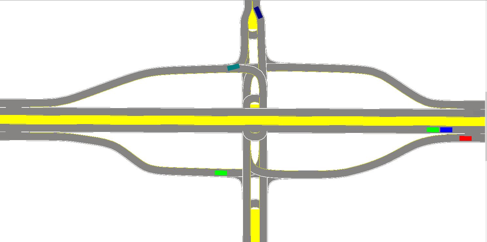

## What happened to RoadBuilder
The development of 2019 RoadBuilder was given up after I started my first job of my career. Apart from the fact that I have less time to spend on it after graduation, there are a few concrete technical reasons why it couldn't go much further.
### Issue 1: Performance
Performance issues have been bothering me through the entire development, due to the fact that a smooth 3D road mesh would require thousands of triangles, let alone longer roads that require even more. Without LODs, deformable mesh or use of a prefab library, even rendering them becomes a nightmare on average hardware. However, these topics were too advanced for me at that time as a new grad. It's also time-consuming to get these perfectly working, considering it's a hobby project.
### Issue 2: Choice of game engine
Unity, on the other hand, is probably not the best choice for the dev platform, due to the lack of high-quality public math libraries in C#, the awkward experience implementing UI inside it (before the introduction of UI-Toolkit), and the expensive performance overhead from the editor itself.

You probably want to ask me why Unity was chosen in the first place. Well, you get relatively performant 3D scene and renderer for free, and there are tons of fancy prefabs out there. These may benenifit the project in the long term if it eventually evolves into a game, but the frustration from its downside would have already beaten me up by then.
### Issue 3: Hard-to-track bugs
I was not too scared of bugs for the first few months into serious development, until I encountered something that took me 5 hours to fix. After spending dozens of nights with these mysterious issues, I finally learned the importance of thorough testing, but it was too late. The last release still contained mysterious issues that occasionally broke the program, leaving me with no clue with what's going on.

Why are those bugs so hard to track down? One thing is the lack of unit testing with the mostly self-written math library. Another is the poor reproducibility as its action space grows infinitely. Ultimately, many bugs are only reproduceable by certain action sequences (like the mouse must be at x,y while you press a key), which can easily slip away when you try to catch it manually. 

## Reinventing RoadBuilder -> RoadRunner
Even though there hasn't been any development in the past four years, the idea of bringing it up again never left my mind. With all the lessons I learned from the 2019 attempt, I come to realize I'm in a better-than-ever position of creating something really usable and maintainable.

Before getting my feet wet, I must convince myself that I will not run into any of those pitfalls again. Hence, the following are the rules that I have to play by.
### Answer 1: Time complexity should not grow with map size
Since there's no limit on how long a road extends or how many junctions a map contains, any program sequence following a user instruction must be "local", i.e. it should only operate on the area that actually changes.

A simple example involves road mesh / graphics generation. For instance, one wants to trim the last 10 meters from a 1km road. The algorithm should not waste time re-creating the rest 990 meters, or its complexity would blow up if the road were 10km long.

There are few exceptions to the rule, for example, rendering and collision detection can't stay purely "local". However, those are cheap compared to creating new objects in memory, and existing libraries are so sophisticated that their performance impact is minimal.
### Answer 2: Qt Framework in C++
The Qt5 framework, as a collection of libraries and header files, is much more lightweight and flexible than a 3D game engine. This frees me from the performance overhead and frustrating license management of Unity or Unreal editor, greatly accelerates the development of basic user interface, and is able to run on a wide range of hardware platforms with entry-level processing power. With either CMake or qMake, running cross-platform is easy as breeze.

Of course, inside a 2D-focused UI framework, developing a 3D game-like program isn't that feasible. Nevertheless, a 2D interface is 99% enough for a road network editor / viewer, since height values can still be represented just like how Google/Apple Map works. The output of this map editor, on the other hand, could then be imported to game engines for a better visualization or simulation.
### Answer 3: A fully testable and replayable program
Tests of all kinds are created and repeated as the functionality expands. For example, the program by default runs a thorough internal check after each edit to the map and reports any inconsistency.

Every user input, including mouse and key events, are recorded and stored automatically, ensuring we don't lose a single opportunity to spot new bugs. This part will be covered in posts that follow.

### In a nutsell, RoadRunner is primarily a road editor, not a game
A game carries way more requirements than an editor. Let's think about how to get a road editor's job done right, before worrying about turning this into a game or simulator. Even if I can't make that far, it would still be a handy tool for game making.

As a road editor, it's essential that it outputs something that everyone can grab and use. [ASAM OpenDRIVE](https://www.asam.net/standards/detail/opendrive/) as an industrial standard widely used by many simulators, is my choice. There's also [an excellent library](https://github.com/pageldev/libOpenDRIVE) that saves me a bunch of time dealing with the standard itself, especially the mathematical aspect.

It's important to note that OpenDRIVE defines a much wider set of features than what I'm planning to have in this project. Please consult the real [MathWorks RoadRunner](https://www.mathworks.com/products/roadrunner.html) if you wish are looking for something rich in features. Be aware there's a huge commitment in time and $$$ to use it. This tiny RoadRunner, on the other hand, aims to provide a quick, simple and no-cost tool for map hobbyists. Here, only **a small subset** of OpenDRIVE standard is supported, without losing the ability to create fairly realistic roads.

*The initial version of RoadRunner is planned to release this summer, after half-a-year part-time development. Please stay alert.*