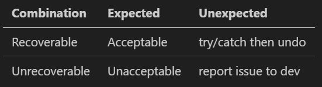

## What kind of errors are we talking about?
Like any input-intense GUI, there are almost infinite ways something inside RoadRunner could go wrong. Roughly speaking, the errors I encountered can be classified as follows.
### Expected vs unexpected errors
Expected errors are those encountered during development and recognizable by the program. For instance, the most common expected error is invalid user input, such as creating a curve with zero length (clicking on the same spot). Others include filesystem error (failure to create saves), deserialization error (trying to load a version-outdated map), etc. Invalid user input, however, is of the most variety and the hardest kind to handle.

Unexpected errors, on the opposite side, are generally those considered as "bugs". They can be unhandled / unprevented invalid user input, or more often, algorithm error. In RoadRunner, there are a few with a bit complexity that could result in these kind of errors, like profile -> xodr lane section converter, junction generator, and perhaps traffic lights generator in the future. These algorithms have to be unit-tested at all possibilities, but we still can't deny the chance that they fail someday.

### Recoverable vs unrecoverable errors
When an error occurs, the best outcome is that we return to the previous state, without having to restart the program and potentially lose any work. However, there are certain errors that leads to instantly crash like memory access violation, and those put the program into an invalid state (for instance, random number of road linkages are broken) that there's no point proceeding further (any verification will fail; output xodr map will be broken). Those are unrecoverable errors.

## Strategy towards each combinition

As the program goes through more mileage, more unexpected errors are discovered and turned into expected. We have to make sure all expected errors are properly brought to attention and automatically recovered. It's also preferred that errors are brought up at the earliest point, cutting off subsequent actions, except when the implementation overcomplicates the code.

With unexpected errors, we cannot tell where/when exactly they will happen, so all we can do is properly record and report them, and let the user know at earliest convenience.

There are various ways an error's brought to user attention. 
- The best practice is through some visual hint, like showing a warning sign on the map or turning the hint line red. These are sometimes inconvenient to implement though, and bears the risk of over-engineering. 
- An alternative is printing a human-readable message (spdlog::info or spdlog::warn) to the console, telling the user what's not allowed. If it's simply because of a misclick, then this message won't bother him at all.
- If more attention is necessary, like when a bug is found, then we shall pop up a message box and interrupt the interaction explicitly. In the meantime, print additional information to console (spdlog::error or spdlog::fatal) so that developers can find out the reason quicker.

## A concrete example
Let's think about the feature of lane drawing. We have to handle each of the following errors:
1. User tries to start off a ramp from the center of a 3-lane highway.
2. User tries to draw a ramp involving a very sharp turn.
3. The direct junction generation algorithm, upon editing completion, tries to access an invalid memory address.
4. The generated direct junction doesn't pass verification, e.g. unrelated lanes are somehow linked together.

Error 1 is an expected error. We can just prohibit the ramp from starting at that place, since it's easy enough to program. The error is prevented at the earliest stage.

Error 2 is also expected. We can do similar things by showing a red ref line to prevent the user from drawing further. However, if we want to keep it simple, or if detecting the error is costly (affecting FPS), we can just print a warning message to the console.
Please note that by the time this error is discovered in Complete() function, the road-creating tool could have already done something to the map (such as cutting another road to two to form a junction). In this case we have to recover to the previous state to "pretend" nothing happened from the user's perspective. This is where undo/redo comes in rescue -- just trigger an implicit undo.

Error 3 is an unexpected, unrecoverable error, as the program will be killed immediately by the OS. With the action recording mechanism, luckily, most errors of this kind are replayable, although that takes significantly longer amount of time than a simple undo. So in most cases user can replay the action file, except the last action that triggers the exception.
As a developer, it's more important to find out the logic error that triggers the error, than adding a check immediately before the error to prevent the program from crashing. But if the former is impossible, we should still do the latter so that bad things happen in a more graceful way (see the next paragraph).

Error 4 is an unexpected but recoverable error. Although it's "caught" in the verification process, it's still considered unexpected because we "expect" the verification to always pass. All errors in the verification process will be caught in the outmost try/catch block, popping up a message box. The user can now choose to continue and manually perform an undo -- this will usually bring him to a normal state. As a developer, I would usually choose to quit and start debugging the saved action file that triggered this error. A potential improvement is that the error log from any user is automatically uploaded and brought to the developer's attention.

## Conclusion
Error handling is always an open question -- there's no silver bullet. The best error handling process is always tailored to the application and the types or errors to handle, to best serve developers and users.
The process handled above has saved me numerous hours -- the majority of bugs were troubleshooted within an hour or so. 

As the development goes and more features are brought in, this process is always worth revisiting and modernizing -- especially when the average troubleshooting time goes up.
