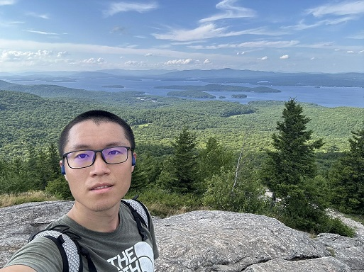

My name is Jiakang Guo, a software engineer working and living in south New Hampshire, US. I obtained Master's degree in CS at Columbia University in the city of New York.

My interest is primarily in computer simulation and related things: computational physics, computer graphics, parallel simulation, etc. I also love making and playing simulation-focused games.

New Hampshire's beautiful nature always inspires my work and life.
